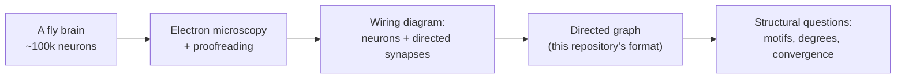
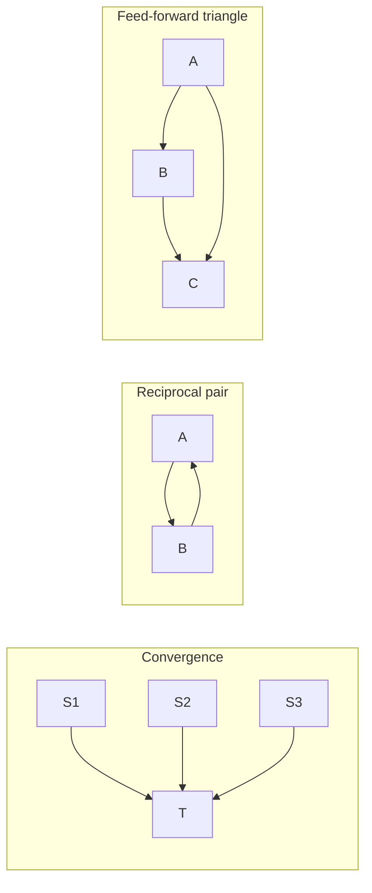
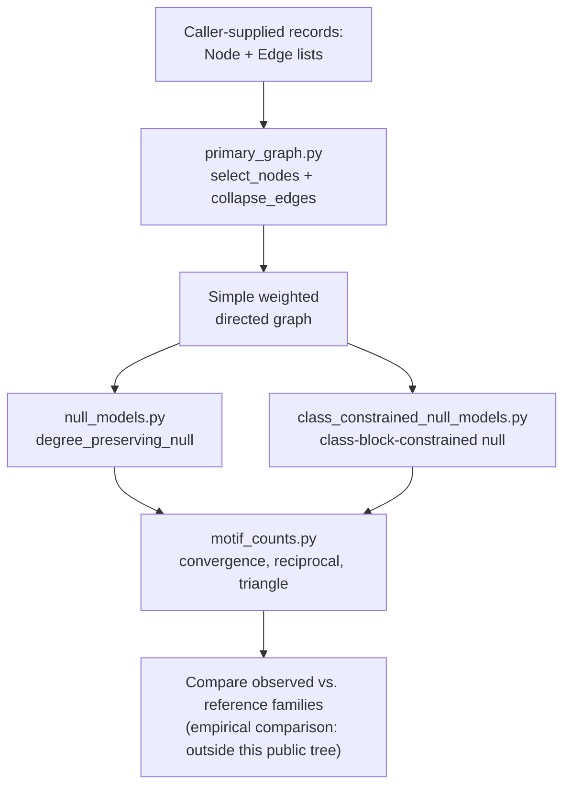
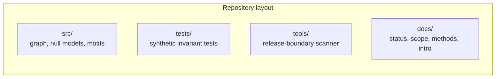

# Extended Introduction: Connectomes, Learning Circuits, and Null Models from Scratch

This document assumes **zero neuroscience background**. It explains every idea in plain language with analogies, then shows how each idea maps onto the actual code in this repository. For a shorter version with the full literature list, see [Introduction](INTRODUCTION.md); for what the project concluded, see [Current Results and Discussion](CURRENT_RESULTS_AND_DISCUSSION.md).

There is no single correct mental model for the core ideas, so each major concept below is followed by a **"many roads"** subsection: several independent mathematical lenses on the same idea, each with a tiny fully-worked example you can check by hand. Take whichever road matches how you think; skip the rest. None require calculus or differential equations — only counting, sets, and tables.

**Concept figure.** The repository's whole method — wiring diagram to directed graph, motif counting, and the degree-preserving shuffle that decides whether a count is surprising — is drawn in [concept_figure.md](concept_figure.md) as an embedded Mermaid diagram. (The release boundary does not allow image files in the tracked tree, so the figure lives as text.) Parts 5 and 6 below work through the same pipeline as explicit hand-countable arithmetic.

## Start here: the math toolkit from zero

Every mathematical object this document uses is defined in this section — three plain sentences or fewer each, plus one tiny numeric example you can verify by hand. Nothing outside this section is assumed. If a symbol later looks unfamiliar, come back here.

- **Variable.** A variable is a named slot that holds a number, like a labeled jar. The label stays; the contents can change. Example: let $w$ hold 0.3; after learning it may hold 0.15, and it is still the jar called $w$.
- **Subscript.** A subscript is a position label on a letter: $x_3$ means "the $x$-value at position 3." It lets one letter name a whole list of numbers. Example: if weights are 0.2, 0.3, 0.1 then $w_1 = 0.2$, $w_2 = 0.3$, $w_3 = 0.1$.
- **Set and membership.** A set is a collection of distinct things in curly braces, and its only question is membership: in ($\in$) or out ($\notin$). Example: if $E = \{(A,B), (B,C)\}$, then $(A,B) \in E$ and $(B,A) \notin E$ — the ordered pair has a direction.
- **Ordered pair.** An ordered pair $(x, y)$ is two items where order matters, like a from-and-to address. Swapping the order makes a different pair. Example: $(17, 42)$ and $(42, 17)$ are different pairs, just as "17 signals to 42" differs from "42 signals to 17."
- **Sum, the symbol $\sum$.** The symbol $\sum$ means "add up everything in this range," with the start and stop written below and above. It is an adding loop in one sign. Example: $\sum_{i=1}^{3} w_i = 0.2 + 0.3 + 0.1 = 0.6$.
- **Matrix (weight table).** A matrix is a table of numbers with rows and columns; here, the cell in row $i$, column $j$ holds the weight of the connection from $i$ to $j$. Row sums and column sums are then just adding across or down. Example: if column A of the table holds 0, 0, 1, 4, the total incoming drive to A is $0 + 0 + 1 + 4 = 5$.
- **Probability as a fraction of cases.** A probability is a count of favorable cases divided by a count of all cases, always between 0 and 1. Example: if only 10 of 1000 shuffled graphs matched the real motif count, the fraction is $10/1000 = 0.01$.
- **Average (mean).** A mean is a total divided by how many items you added — the equal share. Example: the mean of shuffled counts 0, 1, 2 is $(0 + 1 + 2)/3 = 1$.
- **$\log_2$, the number of halvings.** $\log_2(n)$ asks how many times you can halve $n$ before reaching 1 — the same as how many yes/no questions pin down one of $n$ equally likely options. Example: $\log_2(16) = 4$, because $16 \to 8 \to 4 \to 2 \to 1$ is four halvings.
- **Graph (nodes plus edges).** A graph is a set of dots (nodes) joined by arrows (directed edges). An arrow $A \to B$ says "A can influence B," and it does not imply $B \to A$. Example: nodes $\{A, B\}$ with edges $\{A \to B, B \to A\}$ form a two-way street — a reciprocal pair.
- **Degree (in and out).** A node's in-degree counts its incoming arrows and its out-degree counts its outgoing arrows. They are tallies, nothing more. Example: in the graph A→B, A→C, C→A, node A has in-degree 1 and out-degree 2.
- **"Choose" counting, $\binom{n}{k}$.** The symbol $\binom{n}{k}$ counts how many ways you can pick $k$ items from $n$ when order does not matter. It is computable by listing or by one multiply-and-divide line. Example: $\binom{4}{2} = \frac{4 \times 3}{2 \times 1} = 6$, and the six pairs are easy to list: AB, AC, AD, BC, BD, CD.
- **Fixed point / invariant.** An invariant of a procedure is a property it refuses to change; a fixed point is a value a rule maps to itself. Both say "this stays put while everything else moves." Example: the target swap A→B, C→D becoming A→D, C→B leaves every node's in- and out-degree fixed — degree is the invariant of the shuffle.
- **Feedback loop / iteration.** Iteration means applying one rule to its own output, over and over. Each repetition is one row of a table. Example: repeatedly applying "move the token along every outgoing arrow" to the graph D→A, A→B, A→C gives tokens at D, then A, then {B, C} — three rows, three hops of reach.

## Part 1: What is a connectome?

Your brain contains billions of nerve cells, called **neurons**, and they talk to each other through connections called **synapses**. A **connectome** is the complete wiring diagram of a nervous system: a list of every neuron and every connection between them.

Here is the most useful analogy: a connectome is like a **road map** of a country. The map tells you which towns are connected by roads and which direction each road runs. But a road map does *not* tell you the **traffic** — which roads are busy at rush hour, which ones are closed for repairs, or where any particular car is going. In the same way, a connectome tells you which neurons *could* signal to which other neurons, but not what signals actually flow when an animal learns, decides, or acts (references [12] and [13] in the introduction). Understanding traffic requires additional experiments: recordings of neural activity, perturbations, behavioral measurements. This repository works only with the road map, and it is careful — deliberately — not to claim anything about traffic.

## Part 2: Why the fruit fly?

Mapping every connection in a human brain is far beyond current technology. The fruit fly *Drosophila melanogaster* has a brain small enough — roughly a hundred thousand neurons — that researchers have actually reconstructed the whole adult wiring diagram in a community electron-microscopy effort (reference [1]). Think of it this way: if the human brain is the road network of an entire planet, the fly brain is one well-mapped city. It is small enough to study completely, yet still complex enough to be interesting — flies learn, remember, navigate, and make decisions. Earlier reconstructions covered the adult central brain (reference [8]), a visual pathway (reference [10]), and the larval brain (reference [9]), so each study must state which map it uses rather than treating fly connectomes as interchangeable. Annotation work and a public connectivity explorer provide cell labels and views for the whole-brain dataset (references [14] and [15]).

### The many roads to "a wiring diagram"

**Road 1: set theory.** A connectome is two sets and a membership test: a set of nodes N and a set of edges E, where each edge is an ordered pair (source, target) drawn from N × N. "Is neuron 17 connected to neuron 42?" is the question "is the pair (17, 42) a member of E?" Worked example: N = {A, B, C, D}, E = {(A,B), (A,C), (B,C), (C,A), (D,A)}. Then (A,B) ∈ E — connected; (B,A) ∉ E — not connected, because edges are *ordered* pairs. Direction is nothing more mysterious than the difference between (A,B) and (B,A). Formally,

$$G = (N, E), \qquad N = \{A, B, C, D\}, \quad E = \{(A,B), (A,C), (B,C), (C,A), (D,A)\}$$

where $G$ is the graph, $N$ its node set, $E$ its edge set, and every wiring question is settled by checking membership: $(A,B) \in E$ is true, $(B,A) \in E$ is false — the worked example restated as symbols. *What this buys you:* total precision with zero machinery; every graph question is a membership question. *What it costs you:* membership is silent about strengths, dynamics, and meaning.

**Road 2: linear algebra as weight tables.** Write the wiring as a table with one row and one column per neuron, where the cell (row i, column j) holds the total synaptic weight from i to j (0 if no edge). The whole connectome is then a single inspectable table. Worked example on the same four nodes, edges with weights 2, 1, 3, 1, 4: the table has row A = (0, 2, 1, 0), row B = (0, 0, 3, 0), row C = (1, 0, 0, 0), row D = (4, 0, 0, 0). Tracing one cell: row C, column A holds 1, meaning "C→A carries weight 1." Weighted sums down a column give each neuron's total incoming drive — column A sums to 0 + 0 + 1 + 4 = 5. Formally, the table is a matrix $W$ whose entries are $W_{ij}$, and the total incoming drive to node $j$ is a column sum,

$$W = \begin{pmatrix} 0 & 2 & 1 & 0 \\ 0 & 0 & 3 & 0 \\ 1 & 0 & 0 & 0 \\ 4 & 0 & 0 & 0 \end{pmatrix}, \qquad \text{drive into } A = \sum_i W_{i,A} = 0 + 0 + 1 + 4 = 5$$

where $W_{ij}$ is the weight from $i$ to $j$ and the $\sum_i$ adds down the column — the 5 is exactly the column tally of the worked example. *What this buys you:* arithmetic on the wiring — total inputs, total outputs, common partners — becomes row and column sums. *What it costs you:* a table of 100,000 neurons is $10^{10}$ cells, so the table is a way of thinking, not a way of storing.

**Road 3: automata and computation.** Read the wiring as the transition graph of a state machine: each neuron is a state-holder, each edge a wire that lets one state's activity influence the next. "Activity flows through the connectome" becomes: put a token on node A, and at each step move copies of the token along every outgoing arrow. Worked example on the four-node graph: start with a token on D (out-edges: D→A). Step 1: token on A (out-edges: A→B, A→C). Step 2: tokens on B and C. Step 3: B→C and C→A give tokens on C and A. Three steps showed that D can influence C within 3 hops — a reachability fact you read off by hand. Formally, the set $R_k$ of nodes reached within $k$ hops obeys

$$R_{k+1} = R_k \cup \{v : (u, v) \in E \text{ for some } u \in R_k\}, \qquad R_0 = \{D\},\ R_1 = \{D, A\},\ R_2 = \{D, A, B, C\}$$

where the rule says "add every node that an already-reached node points to" — the three rows of the worked example are $R_0, R_1, R_2$ exactly, and C appears in $R_2$, which is the reachability fact. *What this buys you:* signal flow as token-passing you can simulate on paper. *What it costs you:* real synapses are not tokens; this road says nothing about timing, strength, or inhibition.

**Road 4: geometry.** Give each neuron coordinates and let "close together" mean "likely to be related." Worked example: place A at (0,0), B at (1,0), C at (0,1), D at (5,5). Distances: A–B is 1, A–C is 1, A–D is about 7. The wiring A→B and A→C now *looks* local while D→A looks long-range — geometry turns the abstract edge list into a picture with near and far. Formally, the distance between two placed nodes is

$$d(A, D) = \sqrt{(x_A - x_D)^2 + (y_A - y_D)^2} = \sqrt{(0-5)^2 + (0-5)^2} = \sqrt{50} \approx 7.07$$

where the formula is "square the horizontal and vertical gaps, add, then take the root that undoes the squaring" — and it reproduces the worked example's A–B distance $\sqrt{1} = 1$ and A–D distance of about 7. *What this buys you:* spatial intuition — neighborhoods, clusters, long-range shortcuts. *What it costs you:* the coordinates are a choice (real anatomy, or an invented layout), and a bad layout can make the same wiring look random or ordered.

## Part 3: What does "learning architecture" mean?

Flies can learn: for example, they can learn that a particular smell predicts a small electric shock, and they will avoid that smell afterward. The brain region most associated with this kind of learning is the **mushroom body**. In plain terms, the mushroom body is the fly's classroom. Simplified, it works like this (reference [7]):

- **Kenyon cells (KCs)** are a large population of neurons that each receive a sparse, somewhat random mixture of smell inputs — like many students each writing down a different partial sketch of the same lecture.
- **MBONs (mushroom body output neurons)** read the KCs' combined activity and turn it into behavior-relevant output, such as "approach" or "avoid" — like the class jointly reaching a verdict.
- **MBINs (mushroom body input neurons, including dopaminergic neurons)** deliver teaching signals — "that went well" or "that went badly" — that adjust how strongly KCs influence MBONs, like feedback changing which notes the class trusts next time.

The word **architecture** means the *pattern of connections*: who connects to whom, in what direction, with what convergence and feedback. A natural question is whether the mushroom body's wiring contains distinctive structural patterns — for instance, particular small circuits — that might support learning. That kind of question is what motivated this project. But the project is equally emphatic about what wiring *cannot* tell you: a structural pattern is not proof of a learning mechanism (reference [2]).

### The many roads to a learning circuit

**Road 1: linear algebra as weight tables.** Learning, in this circuit, is editing one table: the KC→MBON weight table. Before learning, the smell "apple" might drive an MBON with weighted sum 0.2 + 0.3 + 0.1 = 0.6; after the teaching signal arrives, the rule lowers the active cells' weights, say halving them: 0.1 + 0.15 + 0.05 = 0.3 — the same smell now drives the output half as much. Tracing one cell: the weight from KC #2 to the MBON went 0.3 → 0.15, and that single cell's edit is "a synapse changed." Formally, the drive is a weighted sum and learning a rescaling,

$$\text{drive} = \sum_j w_j\, x_j = 0.2 + 0.3 + 0.1 = 0.6, \qquad w_j \leftarrow \tfrac{1}{2} w_j \;\Rightarrow\; \text{drive} = 0.3$$

where $x_j = 1$ marks the KCs active for this smell, $w_j$ are their weights onto the MBON, and the arrow $\leftarrow$ reads "is replaced by" — halving every weight halves the sum, which is the whole before/after of the worked example. *What this buys you:* learning as auditable arithmetic on a table — you can watch exactly which cells moved. *What it costs you:* the table hides *why* the teaching signal arrived when it did; it records consequences, not reasons.

**Road 2: information theory by counting.** The sparse KC layer is an expander: a smell described by, say, 4 active inputs out of 20 is recoded into many more KC combinations. Count the options: the number of ways to choose 4 active inputs from 20 is (20×19×18×17)/(4×3×2×1) = 4845, so the input layer can name fewer than 5000 smells; if the KC layer has 2000 cells with 40 active per smell, the number of nameable patterns is astronomically larger — that expansion is *why* similar smells can be told apart. Formally, the count is a choose-number,

$$\binom{20}{4} = \frac{20 \times 19 \times 18 \times 17}{4 \times 3 \times 2 \times 1} = \frac{116280}{24} = 4845$$

where the numerator counts ordered picks (20 choices, then 19, then 18, then 17) and the denominator divides out the $4 \times 3 \times 2 \times 1 = 24$ orderings of the same four inputs — one line of arithmetic reproducing the worked count. *What this buys you:* a counting argument for why the architecture is built wide and sparse. *What it costs you:* counts of possible patterns are not counts of usable ones; real discriminability depends on the readout, not just the combinatorics.

**Road 3: game theory as teacher-versus-synapse.** View learning as a repeated game: the teaching signal punishes synapses that voted wrong. Each KC→MBON synapse is a player whose "move" is its weight; after each outcome, players who voted with the losing side lose points and must shrink. Worked example as a 2×2 table — synapse votes "avoid," outcome was "safe": penalty 2; synapse votes "avoid," outcome was "dangerous": reward 1; votes "approach" with "safe": reward 1; votes "approach" with "dangerous": penalty 3. A synapse that keeps its ears open drifts toward voting with the outcome-correlated side — nobody needs to understand the whole circuit for the table of local payoffs to push weights the right way. Formally, the expected payoff of a vote $v$ is a probability-weighted average,

$$E[\text{payoff} \mid v] = \sum_{\text{outcomes } o} P(o)\, \text{payoff}(v, o)$$

where $P(o)$ is how often outcome $o$ occurs and the sum adds each payoff times its frequency — so a synapse voting "avoid" in a world that is safe half the time earns $0.5 \times (-2) + 0.5 \times 1 = -0.5$ on average, and drifting toward the better vote is just climbing this average. *What this buys you:* credit assignment as local incentives, no central accountant. *What it costs you:* the payoff table is imposed by the experimenter or the world; the lens does not explain where it comes from.

**Road 4: discrete iterated maps.** Circuit activity is a step-by-step map: the MBON's activity at the next step is a fixed rule of the KCs' current activities (a weighted sum, possibly thresholded). Worked example: rule "MBON_next = sum of active KC weights, keep only if ≥ 0.5." With weights 0.2, 0.3, 0.1 the sum is 0.6 → output 1 (avoid). After learning halves the weights, the same inputs give 0.3 → output 0. The entire behavioral change is one rule evaluated twice with different table entries. Formally the rule is a thresholded weighted sum,

$$\text{MBON}_{t+1} = \begin{cases} 1 & \text{if } \sum_j w_j\, x_j \ge 0.5 \\ 0 & \text{otherwise} \end{cases} \qquad 0.6 \ge 0.5 \Rightarrow 1, \quad 0.3 < 0.5 \Rightarrow 0$$

where the two branches read "output 1 if the weighted sum reaches the threshold, else 0" — and the two evaluations shown are exactly the before-learning and after-learning rows. *What this buys you:* the before/after of learning as two rows of one table. *What it costs you:* real neurons do not tick in synchrony; the step view is a deliberate simplification.

## Part 4: What are directed-graph methods?

Mathematically, a wiring diagram becomes a **directed graph**: each neuron is a **node** (a dot), and each synaptic connection is a **directed edge** (an arrow) from the source neuron to the target neuron. Direction matters because synapses are one-way: neuron A signaling to neuron B does not mean B signals to A.

This repository represents such graphs in memory (`src/primary_graph.py`) using caller-supplied records: `Node` (an identifier plus a label like `"group_a"`), `Edge` (source, target, weight, kind), and `CollapsedEdge` (one aggregated arrow per source–target pair, with summed weight and a count of contributing raw edges). The function `collapse_edges` merges repeated arrows between the same pair of neurons and drops self-loops, producing a simple weighted directed graph. Null-model helpers (`src/null_models.py`, `src/class_constrained_null_models.py`) then build rewired comparison graphs, and motif helpers (`src/motif_counts.py`) count small patterns.

## Part 5: What is a network motif?

A **network motif** is a small recurring pattern of arrows — usually two or three nodes — that researchers count across a big network (references [3] and [5]). Three motifs appear directly in this repository's code:

- **Convergence** (`count_convergent_targets`): several source neurons all point at the same target — many roads feeding one town.
- **Reciprocal pairs** (`count_reciprocal_cross_group_pairs`): neuron A points to neuron B *and* B points back to A — a two-way street between specific addresses.
- **Feed-forward triangles** (`count_feed_forward_triangles`, also wrapped by `src/m3_feed_forward_triangle.py` for compatibility): a chain with a shortcut — A points to B, B points to C, and A also points directly to C, like an express road running alongside a two-stop route.

Counting a motif is just **description**. The hard part is deciding whether the count is *surprising*.

**Counting by hand, once, so the idea is concrete.** Take a tiny four-node graph with five arrows: A→B, A→C, B→C, C→A, D→A. Now tally each motif by enumeration — this is literally what `src/motif_counts.py` does, just on graphs too big for a notebook margin:

- *Feed-forward triangles* (X→Y, Y→Z, X→Z): only one — A→B, B→C, A→C. The triple (C, A, B) fails because C→A and A→B exist but C→B does not.
- *Reciprocal pairs*: one — A→C and C→A.
- *Convergent targets* (nodes with at least two incoming arrows): A gets arrows from C and D, and C gets arrows from A and B — so two targets have convergence.

Nothing here is more than careful list-checking. Every motif count in this project is this procedure scaled up.

### The many roads to a motif count

**Road 1: set enumeration (the native road).** A motif count is the size of a set you can write out: the set of all triples (X, Y, Z) such that (X,Y), (Y,Z), and (X,Z) all belong to the edge set. In the four-node example that set is {(A,B,C)}, so the count is 1. Listing the set and counting its members are the same act — that is why motif counting is description, not inference. Formally,

$$\#\text{triangles} = \big|\{(X, Y, Z) : (X,Y) \in E,\ (Y,Z) \in E,\ (X,Z) \in E\}\big| = \big|\{(A,B,C)\}\big| = 1$$

where the braces collect every triple passing the three membership tests and the vertical bars count them — the worked tally restated as one set-size. *What this buys you:* absolute transparency; every count can be re-derived by listing. *What it costs you:* the list grows cubically with node count, so the listing road is walked by code, not by hand.

**Road 2: information theory by counting.** How surprising is a count? Compare the questions needed. If a motif's presence in any given triple were a fair coin flip, one triple's status costs 1 yes/no question; if the real network shows triangles in 1 of every 16 triples, locating the triangle takes about $\log_2(16) = 4$ questions. The gap between "1 question if random" and "4 questions observed" is a counting-based measure of structure. Formally,

$$\text{structure} \approx \log_2\!\frac{1}{1/16} - \log_2\!\frac{1}{1/2} = \log_2(16) - \log_2(2) = 4 - 1 = 3 \text{ questions}$$

where each term is the question-cost of locating the motif under one assumption (observed rarity, fair coin) — the 3-question gap is the worked example's measure of structure. *What this buys you:* surprise in units of yes/no questions, comparable across motifs. *What it costs you:* you must state the reference ("fair coin") explicitly — which is exactly the null-model question of Part 6.

**Road 3: geometry.** Think of each small pattern as a shape, and motif counting as asking how often each shape appears as a sub-shape of the big drawing. Feed-forward triangles are "open" shapes (a chain with a shortcut), reciprocal pairs are "closed" shapes (a two-way street); counting shapes is a visual habit humans are good at. Worked example: in the four-node graph, trace the shape A→B→C with A→C — it looks like a triangle missing its B–A side, which is exactly why it counts as feed-forward and not as a cycle. *What this buys you:* fast pattern recognition and memorable vocabulary (open vs closed shapes). *What it costs you:* pictures fail beyond a handful of nodes, and visual salience is not statistical importance.

**Road 4: automata.** Motif counting is a tiny machine scanning the edge list: for each ordered triple it runs a fixed checklist — "edge 1 present? edge 2 present? edge 3 present?" — and increments a counter. Worked example: triple (C, A, B) — is C→A present? yes; is A→B present? yes; is C→B present? no — checklist fails at step 3, counter unchanged. The counter's final value is the motif count, and the machine's state is just the three yes/no answers. Formally the counter accumulates one checklist verdict per triple,

$$\#\text{triangles} = \sum_{(X,Y,Z)} \mathbb{1}\big[(X,Y) \in E\big] \cdot \mathbb{1}\big[(Y,Z) \in E\big] \cdot \mathbb{1}\big[(X,Z) \in E\big]$$

where $\mathbb{1}[\,\cdot\,]$ is a checker that returns 1 if its statement is true and 0 if false, the product is 1 only when all three checks pass, and the sum tallies the passes — on (C,A,B) the third checker returns 0, so the product is 0, exactly the failed checklist. *What this buys you:* the algorithm laid bare — there is no hidden cleverness in `motif_counts.py`. *What it costs you:* the machine view shows how counting works, not what the count means.

## Part 6: What is a null model?

Suppose you count 500 reciprocal pairs in the fly brain. Is that a lot? The honest answer is: **compared to what?** A null model is the "compared to what" made explicit. It is a way of generating randomized comparison networks, so you can ask whether your count is unusual for a network that shares some basic properties with the real one but is otherwise random.

The key idea used here is the **degree-preserving shuffle**. Each node's **degree** is its number of connections — in a directed graph, its **in-degree** (arrows in) and **out-degree** (arrows out). Imagine every neuron is a person holding a fixed number of outgoing and incoming rope ends. The degree-preserving shuffle repeatedly takes two arrows, A→B and C→D, and swaps their targets to get A→D and C→B. Every node keeps exactly the same number of ropes, so all the boring explanations for a motif count — "this neuron just talks a lot" — are held fixed. If a motif is *still* unusually common after thousands of these swaps, the pattern needs a better explanation than raw connectedness (reference [4]). Formally, the swap replaces two edges and keeps every degree fixed:

$$A \to B,\; C \to D \quad \text{become} \quad A \to D,\; C \to B, \qquad \deg^+(v) \text{ and } \deg^-(v) \text{ unchanged for every } v$$

where $\deg^+(v)$ counts arrows leaving $v$ and $\deg^-(v)$ counts arrows entering $v$ — A and C each still send one arrow, B and D each still receive one, which is the invariance in one line.

**One swap, done explicitly.** Use the four-node graph from Part 5: arrows A→B, A→C, B→C, C→A, D→A. Pick the arrows B→C and D→A and swap their targets: they become B→A and D→C. Check the degrees before and after:

| Node | In-degree before | Out-degree before | In-degree after | Out-degree after |
|---|---|---|---|---|
| A | 2 | 2 | 2 | 2 |
| B | 1 | 1 | 1 | 1 |
| C | 2 | 1 | 2 | 1 |
| D | 0 | 1 | 0 | 1 |

Identical columns, different graph — the reciprocal pair A↔C survived, but the feed-forward triangle A→B→C with A→C is gone (B→C no longer exists). That is the whole null-model engine: repeat this swap thousands of times, recount the motifs each time, and you get the reference distribution by brute enumeration rather than by any theorem. Whether the real brain's count sits oddly far out among the shuffled counts is the entire statistical question.

The code implements this in `degree_preserving_null` (`src/null_models.py`), built on a standard graph library's directed edge swap, and then *checks its own work*: after rewiring it raises an error if the degree signature changed or a self-loop appeared. The more constrained variant, `class_constrained_degree_preserving_null` (`src/class_constrained_null_models.py`), additionally preserves the number of edges between each pair of neuron classes — like shuffling road connections while keeping the total count of city-to-suburb, suburb-to-suburb, and suburb-to-city roads fixed. One subtlety the literature makes clear: naive edge swapping can sample some graphs more often than others, so unbiased directed rewiring needs care about how swaps are proposed and accepted (reference [11]).

Crucially, these two null models **ask different questions and can legitimately give different answers**. That is not a software bug; it is a scientific finding. Work on the whole-brain fly connectome shows that network statistics and motifs should be evaluated under multiple reference families (reference [6]), and this project's own headline result is that the reciprocal-pair statistic *changed direction* between its two reference families.

### The many roads to a null model

**Road 1: statistical mechanics by counting.** The set of all graphs with a fixed degree signature is a collection of "microstates," and the shuffle is a random walk among them. If a motif appears in most microstates, seeing it is unremarkable — it is like rolling a total of 7 with two dice, which has 6 of the 36 arrangements. Worked example on our 4-node, 5-edge graph: the degree signature (in/out per node) is A:2/2, B:1/1, C:2/1, D:0/1. Enumerating all 5-edge directed graphs with that signature is a small but real counting exercise; the fraction containing a reciprocal pair is the multiplicity of "reciprocal-pair worlds." Surprise = the real graph belonging to a low-multiplicity macrostate. Formally,

$$P(\text{motif} \mid \text{signature}) = \frac{\#\{\text{graphs with the signature and the motif}\}}{\#\{\text{graphs with the signature}\}}$$

where both terms are pure counts over the enumerated microstates — the dice version is $P(\text{total } 7) = 6/36$, with the 36 arrangements as the denominator and the 6 favorable ones as the numerator. *What this buys you:* "significant" rephrased as "rare among equally lawful arrangements" — no forces, no distributions to memorize, just counting. *What it costs you:* exact enumeration is feasible only for toy graphs; big connectomes need the sampling shortcut, which inherits the swap-bias subtlety of reference [11].

**Road 2: probability as frequencies.** Run the shuffle 1000 times, count the motif each time, and tally. If the real count exceeds 990 of the 1000 shuffled counts, the empirical frequency of "this extreme by chance" is about 10 in 1000. That fraction — a literal recount of the tally — is the p-value, with no formula in sight. Worked example: shuffled triangle counts: 0 (600 times), 1 (300), 2 (90), 3 (10). The real graph has 3 triangles; only 10 of 1000 shuffles reached 3, so the observed count is rare at the 1% level *by direct count*. Formally,

$$p = \frac{\#\{\text{shuffles with count} \ge \text{observed count}\}}{\#\{\text{all shuffles}\}} = \frac{10}{1000} = 0.01$$

where the numerator tallies the shuffles at least as extreme as the real graph (the 10 that reached 3) and the denominator is every shuffle tried — the 1% verdict is one fraction of cases. *What this buys you:* every inferential claim is an auditable histogram. *What it costs you:* 1000 shuffles resolve frequencies no finer than about 1 in 1000; finer claims need proportionally more compute.

**Road 3: set theory and invariants.** The shuffle is defined by what it *refuses to change*: the degree signature (and, in the constrained variant, the class-block edge counts). An invariant partitions the set of all graphs into equivalence classes — graphs sharing the invariant — and the null model says "sample from the real graph's own class." Worked example: graphs {G1, G2, G3} all share signature A:2/2, B:1/1, C:2/1, D:0/1; G4 does not. The null set is {G1, G2, G3}; G4 is excluded *by membership*, not by distance or preference. Choosing a different invariant (add class-block counts) shrinks the set — a different question, a different class, legitimately a different answer. Formally,

$$\text{null set} = \{G : \deg(G) = \deg(G_{\text{real}})\} \;=\; \{G_1, G_2, G_3\}, \qquad G_4 \notin \text{null set}$$

where $\deg(G)$ is the whole degree signature and membership in the null set is decided by matching it exactly — the worked example's exclusion of $G_4$ is the membership test failing. *What this buys you:* the reason the two null models can disagree, stated as pure set inclusion. *What it costs you:* set membership does not tell you which invariant is scientifically right; that judgment lives outside the formalism.

**Road 4: game theory as a skeptic's bet.** The null model is a skeptic who bets: "I can reproduce your impressive count using only degrees." If the skeptic's 1000 attempts match or beat the real count often, the skeptic wins and the count needs no special explanation. Worked example: skeptic's attempts at the triangle count: 0, 1, 0, 2, 1, … with best value 3 reached twice in 1000 tries; your claim "triangles are special" survives only if the skeptic rarely ties you. The degree constraint is the skeptic's handicap — tightening it (class constraints) gives the skeptic more help, which is why a statistic can flip direction when the handicap changes. Formally, the skeptic wins with probability

$$P(\text{skeptic ties or beats you}) = \frac{\#\{\text{skeptic's counts} \ge \text{your count}\}}{1000} = \frac{2}{1000} = 0.002$$

where the tally in the numerator counts the skeptic's successful attempts — on the worked numbers the skeptic wins only 2 tries in 1000, so the claim survives this bet. *What this buys you:* an adversarial intuition for why a harsher null is a stronger test. *What it costs you:* the skeptic is only as informed as the invariant you grant; the lens does not choose the handicap for you.

## Part 7: Why data-free synthetic validation?

Every function in this repository is **data-free**: it operates only on records the caller supplies in memory. It never reads a file, downloads a connectome, or writes a result. The tests (`tests/`) build tiny synthetic graphs — a dozen nodes drawn by hand — and check invariants: does rewiring preserve degrees? Does the class-constrained rewiring preserve block counts? Does an empty input raise the documented error?

Why insist on this? Three reasons:

1. **Trust through simplicity.** If the code never touches data, reviewers can read and verify everything. There is no hidden preprocessing step that could quietly change the answer.
2. **Correctness before science.** A motif counter that miscounts on a 6-node graph will miscount on 100,000 neurons. Synthetic tests catch bugs at the scale where a human can count the arrows by hand.
3. **A clean release boundary.** Keeping empirical material out of the public tree means the repository can be shared, audited, and extended freely (see [Release Boundary](RELEASE_BOUNDARY.md)).

## Part 8: The pipeline end to end

## Part 9: The math, in one sentence each

Each concept below appears directly in the code, and each is defined from zero in the toolkit section at the top of this document.

- **Directed graph**: a set of dots connected by one-way arrows, the native data structure of connectomes — formally $G = (N, E)$ with edges as ordered pairs, as in Part 2.
- **Degree (in/out)**: how many arrows enter and leave a node — the one property every null model here refuses to change (see `degree_signature` in `src/null_models.py`), written $\deg^-(v)$ and $\deg^+(v)$.
- **Edge swap / rewiring**: repeatedly exchanging arrow endpoints to build random graphs with identical degrees — the engine of `degree_preserving_null`; the swap $A \to B,\ C \to D$ becoming $A \to D,\ C \to B$ is one line of set replacement.
- **Permutation test**: judging a statistic by comparing it with what shuffled versions of the same structure produce — the logic behind every null-model comparison, with the verdict a fraction of cases $p = 10/1000$ as in Part 6.
- **Motif count**: a tally of a small arrow pattern, treated as a summary statistic of the whole network — a set size such as $|\{(A,B,C)\}| = 1$; see `src/motif_counts.py` and reference [3].
- **Statistical power / multiple comparisons**: testing many motifs at once inflates the chance of a false "discovery" — with $m$ independent checks each at level 0.01, the chance of at least one false alarm can approach $1 - (1 - 0.01)^m$, which for $m = 10$ is about $0.096$.

## Part 10: What this project actually found

To keep the introduction honest, it ends with the results, stated plainly: the **convergence diagnostic was non-discriminative** under both reference families; the **reciprocal-pair diagnostic changed direction** when the reference family changed; and the **feed-forward-triangle diagnostic has been defined and tested on synthetic graphs only — never run on real data**. The overall conclusion is *inconclusive for enrichment, mechanism, or causation*, with one durable methodological lesson: **the choice of null model is part of the scientific question, not a technical afterthought** (reference [6]).

## References

All references are the numbered list in [INTRODUCTION.md](INTRODUCTION.md), cited here by number only; no new sources were introduced. The entries used above are: [1] the adult-brain wiring diagram reconstruction; [2] the central-complex connectome and its motif analysis; [3] the founding network-motifs paper; [4] the reference on random graphs with fixed degree sequences; [5] the review of motifs in brain networks; [6] the whole-brain fly connectome network-statistics study; [7] the adult mushroom-body connectome; [8] the adult central-brain connectome; [9] the larval insect-brain connectome; [10] the visual-pathway connectome; [11] the study of unbiased degree-preserving randomization; [12] and [13] perspectives on what connectomes can and cannot deliver; [14] the whole-brain annotation study; [15] the public connectivity explorer.

## Learn more (verified links)

Every link below was fetched and verified at the time of writing.

**Connectomes**
- [Connectome](https://en.wikipedia.org/wiki/Connectome) — surveys the science of wiring diagrams and what they can and cannot reveal, the road-map-versus-traffic distinction at the heart of Part 1.

**The mushroom body learning circuit**
- [Mushroom bodies](https://en.wikipedia.org/wiki/Mushroom_bodies) — describes the insect brain structure behind associative learning, the "classroom" whose Kenyon-cell, MBON, and MBIN wiring Part 3 sketches.

**Directed graphs**
- [Directed graph](https://en.wikipedia.org/wiki/Directed_graph) — defines nodes, arrows, and in/out-degrees formally, the exact data structure this repository's code manipulates.

**Network motifs**
- [Network motif](https://en.wikipedia.org/wiki/Network_motif) — introduces recurring small sub-patterns and why researchers count them, matching the convergence, reciprocal-pair, and triangle tallies in Part 5.

**Null models and the degree-preserving shuffle**
- [Configuration model](https://en.wikipedia.org/wiki/Configuration_model) — explains random graphs with a fixed degree sequence, the mathematical home of the shuffle that generates this project's reference families.
- [Permutation test](https://en.wikipedia.org/wiki/Permutation_test) — shows how shuffling turns "is this count surprising" into an auditable fraction of cases, the recount logic behind every p-value here.

**Multiple comparisons**
- [Multiple comparisons problem](https://en.wikipedia.org/wiki/Multiple_comparisons_problem) — explains why testing many motifs at once inflates false discoveries, the caution flagged in Part 9.

## Choosing your road

If you think in dots, arrows, and shapes, take **graph theory** and **geometry** — a connectome is a drawing, a motif a sub-shape. If you think in membership tests and invariants, take **set theory** — a null model is an equivalence class, an edge an ordered pair. If you think in tables of numbers, take **linear algebra as weight tables** — wiring is a matrix and learning is editing cells. If you think in tallies and enumeration, take **statistical mechanics by counting** and **probability as frequencies** — surprise is low multiplicity, and a p-value is a recount. If you think in questions and answers, take **information theory** — structure is how many yes/no questions the network saves you. If you think in machines and checklists, take **automata** — a motif counter is a three-question checklist in a loop. If you think in incentives and adversaries, take **game theory** — a null model is a skeptic with a handicap, and a teaching signal is a payoff table. If you think in step-by-step rules, take **discrete iterated maps** — circuit activity is one rule evaluated row after row.
