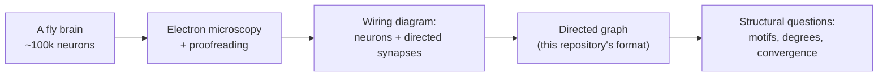
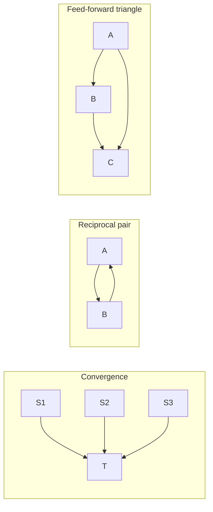
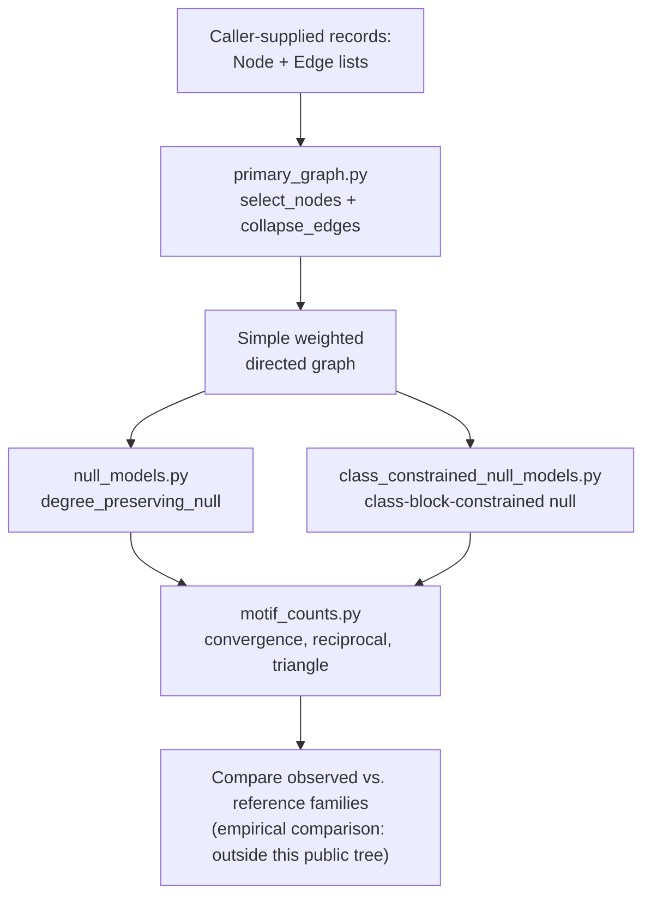
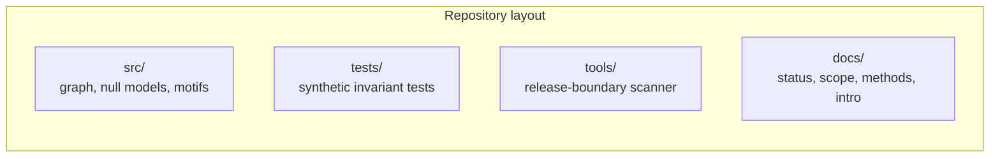

# Extended Introduction: Connectomes, Learning Circuits, and Null Models from Scratch

This document assumes **zero neuroscience background**. It explains every idea in plain language with analogies, then shows how each idea maps onto the actual code in this repository. For a shorter version with full citations, see [Introduction](INTRODUCTION.md); for what the project concluded, see [Current Results and Discussion](CURRENT_RESULTS_AND_DISCUSSION.md).

## Part 1: What is a connectome?

Your brain contains billions of nerve cells, called **neurons**, and they talk to each other through connections called **synapses**. A **connectome** is the complete wiring diagram of a nervous system: a list of every neuron and every connection between them.

Here is the most useful analogy: a connectome is like a **road map** of a country. The map tells you which towns are connected by roads and which direction each road runs. But a road map does *not* tell you the **traffic** — which roads are busy at rush hour, which ones are closed for repairs, or where any particular car is going. In the same way, a connectome tells you which neurons *could* signal to which other neurons, but not what signals actually flow when an animal learns, decides, or acts. Understanding traffic requires additional experiments: recordings of neural activity, perturbations, behavioral measurements (Bargmann and Marder 2013, doi:10.1038/nmeth.2451; Meinertzhagen 2018, doi:10.1242/jeb.164954). This repository works only with the road map, and it is careful — deliberately — not to claim anything about traffic.

## Part 2: Why the fruit fly?

Mapping every connection in a human brain is far beyond current technology. The fruit fly *Drosophila melanogaster* has a brain small enough — roughly a hundred thousand neurons — that researchers have actually reconstructed the whole adult wiring diagram in the **FlyWire** project (Dorkenwald et al. and the FlyWire Consortium 2024, doi:10.1038/s41586-024-07558-y). Think of it this way: if the human brain is the road network of an entire planet, the fly brain is one well-mapped city. It is small enough to study completely, yet still complex enough to be interesting — flies learn, remember, navigate, and make decisions. Earlier reconstructions covered the adult central brain (Scheffer et al. 2020, doi:10.7554/eLife.57443), a visual pathway (Takemura et al. 2017, doi:10.7554/eLife.24394), and the larval brain (Winding et al. 2023, doi:10.1126/science.add9330), so each study must state which map it uses rather than treating fly connectomes as interchangeable. The FlyWire annotation study and the FlyWire Codex explorer provide cell labels and connectivity views for the whole-brain dataset (Schlegel et al. 2024, doi:10.1038/s41586-024-07686-5; FlyWire Codex, codex.flywire.ai).

## Part 3: What does "learning architecture" mean?

Flies can learn: for example, they can learn that a particular smell predicts a small electric shock, and they will avoid that smell afterward. The brain region most associated with this kind of learning is the **mushroom body**. In plain terms, the mushroom body is the fly's classroom. Simplified, it works like this (Li et al. 2021, doi:10.7554/eLife.62576):

- **Kenyon cells (KCs)** are a large population of neurons that each receive a sparse, somewhat random mixture of smell inputs — like many students each writing down a different partial sketch of the same lecture.
- **MBONs (mushroom body output neurons)** read the KCs' combined activity and turn it into behavior-relevant output, such as "approach" or "avoid" — like the class jointly reaching a verdict.
- **MBINs (mushroom body input neurons, including dopaminergic neurons)** deliver teaching signals — "that went well" or "that went badly" — that adjust how strongly KCs influence MBONs, like feedback changing which notes the class trusts next time.

The word **architecture** means the *pattern of connections*: who connects to whom, in what direction, with what convergence and feedback. A natural question is whether the mushroom body's wiring contains distinctive structural patterns — for instance, particular small circuits — that might support learning. That kind of question is what motivated this project. But the project is equally emphatic about what wiring *cannot* tell you: a structural pattern is not proof of a learning mechanism (Hulse et al. 2021, doi:10.7554/eLife.66039).

## Part 4: What are directed-graph methods?

Mathematically, a wiring diagram becomes a **directed graph**: each neuron is a **node** (a dot), and each synaptic connection is a **directed edge** (an arrow) from the source neuron to the target neuron. Direction matters because synapses are one-way: neuron A signaling to neuron B does not mean B signals to A.

This repository represents such graphs in memory (`src/primary_graph.py`) using caller-supplied records: `Node` (an identifier plus a label like `"group_a"`), `Edge` (source, target, weight, kind), and `CollapsedEdge` (one aggregated arrow per source–target pair, with summed weight and a count of contributing raw edges). The function `collapse_edges` merges repeated arrows between the same pair of neurons and drops self-loops, producing a simple weighted directed graph. Null-model helpers (`src/null_models.py`, `src/class_constrained_null_models.py`) then build rewired comparison graphs, and motif helpers (`src/motif_counts.py`) count small patterns.

## Part 5: What is a network motif?

A **network motif** is a small recurring pattern of arrows — usually two or three nodes — that researchers count across a big network (Milo et al. 2002, doi:10.1126/science.298.5594.824; Sporns and Kötter 2004, doi:10.1371/journal.pbio.0020369). Three motifs appear directly in this repository's code:

- **Convergence** (`count_convergent_targets`): several source neurons all point at the same target — many roads feeding one town.
- **Reciprocal pairs** (`count_reciprocal_cross_group_pairs`): neuron A points to neuron B *and* B points back to A — a two-way street between specific addresses.
- **Feed-forward triangles** (`count_feed_forward_triangles`, also wrapped by `src/m3_feed_forward_triangle.py` for compatibility): a chain with a shortcut — A points to B, B points to C, and A also points directly to C, like an express road running alongside a two-stop route.

Counting a motif is just **description**. The hard part is deciding whether the count is *surprising*.

## Part 6: What is a null model?

Suppose you count 500 reciprocal pairs in the fly brain. Is that a lot? The honest answer is: **compared to what?** A null model is the "compared to what" made explicit. It is a way of generating randomized comparison networks, so you can ask whether your count is unusual for a network that shares some basic properties with the real one but is otherwise random.

The key idea used here is the **degree-preserving shuffle**. Each node's **degree** is its number of connections — in a directed graph, its **in-degree** (arrows in) and **out-degree** (arrows out). Imagine every neuron is a person holding a fixed number of outgoing and incoming rope ends. The degree-preserving shuffle repeatedly takes two arrows, A→B and C→D, and swaps their targets to get A→D and C→B. Every node keeps exactly the same number of ropes, so all the boring explanations for a motif count — "this neuron just talks a lot" — are held fixed. If a motif is *still* unusually common after thousands of these swaps, the pattern needs a better explanation than raw connectedness (Fosdick et al. 2018, doi:10.1137/16M1087175).

The code implements this in `degree_preserving_null` (`src/null_models.py`), built on NetworkX's `directed_edge_swap`, and then *checks its own work*: after rewiring it raises an error if the degree signature changed or a self-loop appeared. The more constrained variant, `class_constrained_degree_preserving_null` (`src/class_constrained_null_models.py`), additionally preserves the number of edges between each pair of neuron classes — like shuffling road connections while keeping the total count of city-to-suburb, suburb-to-suburb, and suburb-to-city roads fixed. One subtlety the literature makes clear: naive edge swapping can sample some graphs more often than others, so unbiased directed rewiring needs care about how swaps are proposed and accepted (Roberts and Coolen 2012, doi:10.1103/PhysRevE.85.046103).

Crucially, these two null models **ask different questions and can legitimately give different answers**. That is not a software bug; it is a scientific finding. Work on the whole-brain fly connectome shows that network statistics and motifs should be evaluated under multiple reference families (Lin et al. 2024, doi:10.1038/s41586-024-07968-y), and this project's own headline result is that the reciprocal-pair statistic *changed direction* between its two reference families.

## Part 7: Why data-free synthetic validation?

Every function in this repository is **data-free**: it operates only on records the caller supplies in memory. It never reads a file, downloads a connectome, or writes a result. The tests (`tests/`) build tiny synthetic graphs — a dozen nodes drawn by hand — and check invariants: does rewiring preserve degrees? Does the class-constrained rewiring preserve block counts? Does an empty input raise the documented error?

Why insist on this? Three reasons:

1. **Trust through simplicity.** If the code never touches data, reviewers can read and verify everything. There is no hidden preprocessing step that could quietly change the answer.
2. **Correctness before science.** A motif counter that miscounts on a 6-node graph will miscount on 100,000 neurons. Synthetic tests catch bugs at the scale where a human can count the arrows by hand.
3. **A clean release boundary.** Keeping empirical material out of the public tree means the repository can be shared, audited, and extended freely (see [Release Boundary](RELEASE_BOUNDARY.md)).

## Part 8: The pipeline end to end

## Part 9: The math, in one sentence each

Each concept below appears directly in the code. The named resources are free and beginner-friendly; search the quoted title.

- **Directed graph**: a set of dots connected by one-way arrows, the native data structure of connectomes — see 3Blue1Brown or search "graph theory introduction" on Khan Academy.
- **Degree (in/out)**: how many arrows enter and leave a node — the one property every null model here refuses to change (see `degree_signature` in `src/null_models.py`).
- **Edge swap / rewiring**: repeatedly exchanging arrow endpoints to build random graphs with identical degrees — the engine of `degree_preserving_null`; search StatQuest's resampling videos for intuition about shuffling.
- **Permutation test**: judging a statistic by comparing it with what shuffled versions of the same structure produce — the logic behind every null-model comparison; search StatQuest "p-values" and "permutation".
- **Motif count**: a tally of a small arrow pattern, treated as a summary statistic of the whole network — see `src/motif_counts.py`; the concept is covered in Milo et al. (2002).
- **Statistical power / multiple comparisons**: testing many motifs at once inflates the chance of a false "discovery" — search Seeing Theory's chapters on inference for an interactive treatment.

## Part 10: What this project actually found

To keep the introduction honest, it ends with the results, stated plainly: the **convergence diagnostic was non-discriminative** under both reference families; the **reciprocal-pair diagnostic changed direction** when the reference family changed; and the **feed-forward-triangle diagnostic has been defined and tested on synthetic graphs only — never run on real data**. The overall conclusion is *inconclusive for enrichment, mechanism, or causation*, with one durable methodological lesson: **the choice of null model is part of the scientific question, not a technical afterthought** (Lin et al. 2024).

## References

All references are verified against [INTRODUCTION.md](INTRODUCTION.md) in this repository; no new sources were introduced. Plain-text DOIs are given instead of hyperlinks because the repository's release-boundary scanner (`tools/check_public_release_boundary.py`) intentionally flags external URLs in newly added tracked files.

1. Dorkenwald et al. and the FlyWire Consortium (2024), *Neuronal wiring diagram of an adult brain*, Nature. doi:10.1038/s41586-024-07558-y
2. Hulse et al. (2021), *A connectome of the Drosophila central complex reveals network motifs suitable for flexible navigation and context-dependent action selection*, eLife. doi:10.7554/eLife.66039
3. Milo et al. (2002), *Network motifs: Simple building blocks of complex networks*, Science. doi:10.1126/science.298.5594.824
4. Fosdick et al. (2018), *Configuring random graph models with fixed degree sequences*, SIAM Review. doi:10.1137/16M1087175
5. Sporns and Kötter (2004), *Motifs in brain networks*, PLoS Biology. doi:10.1371/journal.pbio.0020369
6. Lin et al. (2024), *Network statistics of the whole-brain connectome of Drosophila*, Nature. doi:10.1038/s41586-024-07968-y
7. Li et al. (2021), *The connectome of the adult Drosophila mushroom body provides insights into function*, eLife. doi:10.7554/eLife.62576
8. Scheffer et al. (2020), *A connectome and analysis of the adult Drosophila central brain*, eLife. doi:10.7554/eLife.57443
9. Winding et al. (2023), *The connectome of an insect brain*, Science. doi:10.1126/science.add9330
10. Takemura et al. (2017), *The comprehensive connectome of a neural substrate for 'ON' motion detection in Drosophila*, eLife. doi:10.7554/eLife.24394
11. Roberts and Coolen (2012), *Unbiased degree-preserving randomization of directed binary networks*, Physical Review E. doi:10.1103/PhysRevE.85.046103
12. Bargmann and Marder (2013), *From the connectome to brain function*, Nature Methods. doi:10.1038/nmeth.2451
13. Meinertzhagen (2018), *Of what use is connectomics? A personal perspective on the Drosophila connectome*, Journal of Experimental Biology. doi:10.1242/jeb.164954
14. Schlegel et al. (2024), *Whole-brain annotation and multi-connectome cell typing of Drosophila*, Nature. doi:10.1038/s41586-024-07686-5
15. FlyWire Codex, *Connectome Data Explorer* (codex.flywire.ai)
