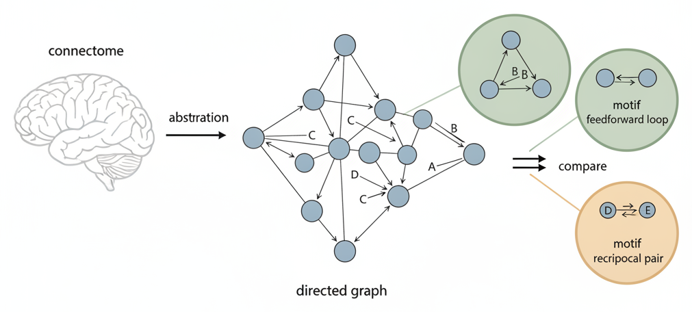

# Introduction: Reading Connectome Patterns Carefully

*Figure 1: A fly wiring diagram is abstracted into a directed graph of nodes and arrows, and specific connection motifs are compared under stated rules. (Editable Mermaid source: [figures/concept_figure.md](figures/concept_figure.md).)*

## Start here

> **Scope of this repository.** This repository studies selected **connection patterns** in a directed-graph representation of a *Drosophila* nervous-system wiring diagram. Its public contents are data-free graph utilities, synthetic software tests, and a qualitative status record. The project asks whether specified patterns differ under stated comparison rules. It does **not** test whether a fly learns, what a circuit computes, how a circuit works, or what causes behavior.

The word “learning” in the repository name can be misleading without this boundary. The subject provides biological context, but the public work is a bounded structural analysis. The result reported here is about how particular connection patterns behave under particular comparison architectures. It is not evidence for learning, memory, activity, function, mechanism, or cause.

## A concept ladder: from a fruit fly to an arrow diagram

### 1. Why start with a fruit fly?

*Drosophila melanogaster* is the scientific name for a fruit fly. It is widely used in research, which makes it a useful setting for asking carefully limited biological questions. That setting does not make a result about flies a result about people, and it does not make every study of a fly circuit a study of learning. For a gentle introduction to why fruit flies are used in research, see the National Institute of General Medical Sciences overview.[16]

A fly has a nervous system: a collection of cells that communicate with one another and help coordinate what the animal senses and does. A **neuron** is one of those cells. A neuron can receive and send signals. A **synapse** is a specialized contact through which one neuron can communicate with another. The details of signaling are rich and change over time, but this repository begins with a narrower question: which cells are represented as connected to which other cells? Introductory neuroscience resources explain the cells and communication before any mathematics is needed.[17]

### 2. What is a connectome?

A **connectome** is a map of connections in a nervous system. It is a structural map: it records a selected kind of connection, not a direct movie of messages moving through the system. Different reconstructions can cover different parts of an animal, different stages of life, or different levels of detail. A connection map is therefore not interchangeable with the animal itself, with a functional experiment, or with every other map of that species. A beginner-level lesson introduces the word “connectome” at several structural scales.[18]

Modern *Drosophila* wiring diagrams make it possible to study connection patterns across large parts of a nervous system.[1] [2] Earlier reconstructions of the adult central brain, an adult visual pathway, and the larval brain show that such maps can differ in anatomical coverage and developmental scope.[8] [9] [10] The mushroom body is a fly circuit often discussed in relation to learning, but a structural pattern in that circuit still does not prove a learning mechanism.[7]

A wiring diagram can constrain ideas about what might be possible, but it cannot by itself establish what is happening at a moment in time. To understand circuit function, researchers also need information such as neural activity, chemical influences, and carefully designed measurements or interventions.[12] [13] This distinction is central to reading the status of this repository without overinterpreting it.

### 3. How does a living connection become an arrow on a page?

To inspect a connection map with a simple, consistent notation, this project uses a **directed graph**. A graph here is not a chart. It is a deliberately simplified map made of points and arrows. A represented neuron becomes a **node**, or point. A represented connection becomes an **edge**, drawn as an arrow. The arrow begins at a **source** node and points to a **target** node. Introductory graph theory uses the same vocabulary for many kinds of linked systems and explains why direction matters.[19]

For example, `A → B` means that the representation records an arrow from neuron A to neuron B. It does **not** by itself say how strong a signal is, whether B responds at a particular time, whether the connection helps or suppresses activity, or what the fly does. `A → B` is also different from `B → A`: arrow direction is part of the description.

This public software works with caller-supplied, in-memory records or graphs. In its retained representation, repeated directed edges are collapsed into one source-to-target pair, and arrows from a node to itself are omitted. Labels and groups are supplied by the caller. These are explicit choices for making a particular graph representation; they are not a complete description of a nervous system and do not establish biological roles.

### 4. What is a small connection pattern?

A **network motif** is a specified small arrangement of arrows. The word “motif” names an arrangement; it does not automatically mean that the arrangement is important, rare, common, functional, or causal. The classic literature on motifs distinguishes a structural arrangement from a claim about how a system operates.[3] [5]

Consider three hypothetical labelled neurons, A, B, and C. If `A → C` and `B → C`, then two sources point to the same target. This is a **convergence** pattern. If `A → B` and `B → A`, then the two neurons form a **reciprocal pair**. If `A → B`, `B → C`, and `A → C`, the three arrows form an **ordered feed-forward triangle**: A occupies the first role, B the middle role, and C the final role. The names describe only the chosen arrow arrangements.

The word “ordered” matters in the triangle example. Swapping the positions or reversing an arrow creates a different specified arrangement. Likewise, the project’s convergence count asks whether a target receives arrows from a chosen number of distinct eligible sources, while its reciprocal count applies to caller-defined groups. These are analysis definitions, not universal names for biological functions.

### 5. Why is counting a pattern not enough?

Suppose the hypothetical diagram contains many convergence patterns. That raw count is a description of the diagram. It does not yet show that convergence is unusually common or unusually rare. A pattern may occur often simply because some nodes have many arrows arriving or leaving.

To use words such as **enriched** (“more than the comparison expects”) or **depleted** (“less than the comparison expects”), the observed count must be compared with counts from a clearly stated collection of comparison graphs. This collection is called a **null model** or **reference model**. It is not a claim that a brain was assembled at random. It is a rule for holding some features of a graph fixed, changing other features, and asking whether the chosen pattern differs from that baseline.[3] [4]

As a simple analogy, imagine comparing a class’s number of left-handed students with other classes. The interpretation changes if the comparison classes must have the same total enrollment, the same age mix, or both. Each comparison can be reasonable, but each answers a slightly different question. Graph comparison works the same way: what is held fixed determines what “different” means. General background on random networks is useful after learning the graph vocabulary, but it is not a substitute for a project’s own comparison specification.[20]

### 6. What do this project’s two comparison families keep the same?

The public utilities include two families of rewired comparison graphs. Both preserve each node’s number of arrows arriving and leaving. Those totals are called **in-degree** and **out-degree**. The second family also preserves coarse totals of arrows between caller-supplied source and target classes. These two valid choices deliberately keep different aspects of a graph unchanged.

| Comparison family | What it holds fixed | What the comparison can ask |
| --- | --- | --- |
| **Degree-preserving** | Each node’s number of incoming and outgoing arrows | Whether the chosen pattern differs once each node’s connection totals are retained |
| **Class-block-constrained** | Those same per-node totals, plus coarse totals between designated classes | Whether the pattern differs under that additional grouping constraint |

Neither family is declared biologically “correct” by this repository. If a pattern looks different under one family but not another, that is not automatically a software error. It means that the structural interpretation depends on the reference architecture. Technical work on directed degree-preserving randomization explains why a sampling procedure must also be specified carefully.[11]

## What this repository is—and is not

A connectome, a reconstruction, a caller-supplied graph, and this repository are different things. A **reconstruction** is a derived map used to identify cells and connections. A **graph representation** is a chosen simplification of such a map. This repository does not distribute a connectome, retrieve a dataset, or encode an empirical input. Its public code builds and evaluates caller-supplied in-memory directed graphs.

The tests use small invented examples, called **synthetic fixtures**. They check whether the code keeps promised properties unchanged during graph construction or rewiring and whether defined patterns are counted as intended. Such tests validate software behavior. They do not validate a biological hypothesis, reproduce a particular animal, or create a new empirical result.

Published work on adult fly wiring diagrams, annotation, and network statistics supplies useful general context for what a reconstruction can make possible.[1] [6] [14] The FlyWire Codex provides views and labels for an identified external resource, but it is not a repository input or evidence for the result stated below.[15] These external materials are background only; they do not change the scope of this public, data-free software repository.

## How to read this project’s status

Read the following as a bounded software-and-structure status record. Here, **completed** means that a predefined structural diagnostic was carried out on a fixed labelled directed representation under the stated reference families. **Non-discriminative** means that the check did not support a structural difference under either of those comparisons. **Reference-sensitive** means that a result was not stable across the approved comparison architectures. **Synthetic-only** means that a definition and related code were tested on invented examples, not calculated on the approved graph.

| Diagnostic | Current status in plain language | What this does **not** establish |
| --- | --- | --- |
| **Convergence** | Completed and non-discriminative under both predefined reference families. The check did not support enrichment or depletion. | A distinctive convergence pattern, a learning computation, function, mechanism, or cause |
| **Reciprocal pair** | Completed, but its direction changed when the reference family changed. The result is therefore not reference-independent. | A robust enrichment or depletion, or that either reference family is the correct one |
| **Ordered feed-forward triangle** | Formally defined and tested on synthetic graphs only. No empirical triangle calculation or null comparison has been run. | Any result about the approved graph or any biological conclusion |

The durable methodological result is narrower than a biological conclusion: the reciprocal-pair statistic is sensitive to the assumed reference architecture. The completed diagnostics are inconclusive for enrichment, mechanism, and causal interpretation. They do not establish what a circuit computes, whether a fly learns, or what causes behavior. The repository’s [current results and discussion](CURRENT_RESULTS_AND_DISCUSSION.md) and [status and plan](STATUS_AND_PLAN.md) give the matching qualitative record.

## How to use the code

The public code constructs caller-supplied in-memory directed graphs, performs degree-preserving and class-block-constrained rewiring, and counts defined patterns. It does not locate files, download material, or create repository outputs. Its synthetic tests check graph and rewiring invariants: properties that an operation is designed to retain. They are safeguards for implementation behavior, not tests of a biological hypothesis.

A reader who wants to extend or review the software should keep the interpretation boundary beside the code boundary. A program can correctly count an arrow pattern on a synthetic graph while still saying nothing about activity, learning, behavior, or causation. Any future use of empirical material, representation choices, or biological interpretation lies outside this public tree and requires an owner decision.

## Glossary

- **Binary directed graph:** A graph that records whether a chosen directed arrow is present, rather than retaining repeated arrows or a connection strength.
- **Cell class (or label):** A caller-supplied name or grouping for represented nodes. It is part of the analysis specification.
- **Connectome:** A map of connections in a nervous system. Its coverage and representation need to be stated.
- **Convergence:** A pattern in which two or more sources point to a shared target.
- **Directed graph:** A map in which each connection is an arrow from a source to a target.
- **Edge (arrow):** The graph name for a represented connection from one node to another.
- **Enriched / depleted:** More / fewer occurrences than expected under a stated comparison rule. A raw count alone does not justify either word.
- **In-degree / out-degree:** The number of arrows arriving at / leaving a node in a directed graph.
- **Network motif (pattern):** A small specified arrangement of arrows. Counting it is descriptive; an enrichment claim requires a stated comparison.
- **Neuron:** A nerve cell that can receive and send signals.
- **Node:** The graph name for an item drawn as a point; here, a represented neuron.
- **Null model (reference model):** A stated rule for generating comparison graphs while retaining selected features.
- **Reciprocal pair:** Two nodes connected by arrows in both directions: `A → B` and `B → A`.
- **Reconstruction:** A derived representation of anatomical material used to map cells and connections.
- **Self-loop:** An arrow from a node to itself. The retained public representation omits self-loops.
- **Synthetic fixture:** A small invented in-memory example used to test software behavior, not evidence about a biological system.

## Learn the basics in this order

The resources below are an ordered **general-background** path. They are not evidence for a repository-specific result, do not identify a repository input, and do not alter the bounded status above.

1. Start with **Research Organism Superheroes: Fruit Flies** for a short, plain-language reason that *Drosophila melanogaster* is a research organism. It supplies organism context without suggesting that a fly graph automatically generalizes to people.[16]
2. Continue with **Introduction to Neuroscience**, especially the sections on nervous-system cells and neuronal communication. This open introductory textbook defines the biological objects before the graph language used here.[17]
3. Watch or consult **What is the Connectome?** next. This beginner-level lesson separates the broad idea of a connection map from the repository’s narrower directed-graph representation.[18]
4. Read **Network Science, Chapter 2: Graph Theory** for nodes, arrows, direction, and in-/out-degree. It provides the shared language needed to read the examples above.[19]
5. Then read **Network Science, Chapter 3: Random Networks** to understand why a randomized graph can serve as a comparison baseline and why assumptions about that baseline matter.[20]
6. For an optional, more technical transition to motifs, read the open scholarly article **Motifs in Brain Networks**. It is general background on structural and functional motifs, not evidence that this repository has established a functional motif.[5]
7. For optional context on an adult fly wiring diagram, read **Neuronal wiring diagram of an adult brain**. Treat it as background on a published reconstruction, not as the source input or evidence for this repository’s status.[1]
8. For optional context on the mushroom body, read **The connectome of the adult *Drosophila* mushroom body provides insights into function**. Background literature about a learning-related circuit does not turn this project’s structural checks into a test of learning.[7]
9. Finally, use the **FlyWire Brain** overview for orientation to the wider adult-fly connectome ecosystem. It is optional background; its linked interactive services are not required for reading or using this repository.[21]

**Editorial note on citations.** External citations in this introduction are general educational or scholarly background, not evidence for a new repository claim. No valid prior GenSpark citation was recoverable from this repository’s reachable history. The project-specific status statements above come from this repository’s own scope and status documents.

## References

[1]: https://doi.org/10.1038/s41586-024-07558-y "Dorkenwald et al. and the FlyWire Consortium (2024), Neuronal wiring diagram of an adult brain"
[2]: https://doi.org/10.7554/eLife.66039 "Hulse et al. (2021), A connectome of the Drosophila central complex reveals network motifs suitable for flexible navigation and context-dependent action selection"
[3]: https://doi.org/10.1126/science.298.5594.824 "Milo et al. (2002), Network motifs: Simple building blocks of complex networks"
[4]: https://doi.org/10.1137/16M1087175 "Fosdick et al. (2018), Configuring random graph models with fixed degree sequences"
[5]: https://doi.org/10.1371/journal.pbio.0020369 "Sporns and Kötter (2004), Motifs in brain networks"
[6]: https://doi.org/10.1038/s41586-024-07968-y "Lin et al. (2024), Network statistics of the whole-brain connectome of Drosophila"
[7]: https://doi.org/10.7554/eLife.62576 "Li et al. (2021), The connectome of the adult Drosophila mushroom body provides insights into function"
[8]: https://doi.org/10.7554/eLife.57443 "Scheffer et al. (2020), A connectome and analysis of the adult Drosophila central brain"
[9]: https://doi.org/10.1126/science.add9330 "Winding et al. (2023), The connectome of an insect brain"
[10]: https://doi.org/10.7554/eLife.24394 "Takemura et al. (2017), The comprehensive connectome of a neural substrate for ‘ON’ motion detection in Drosophila"
[11]: https://doi.org/10.1103/PhysRevE.85.046103 "Roberts and Coolen (2012), Unbiased degree-preserving randomization of directed binary networks"
[12]: https://doi.org/10.1038/nmeth.2451 "Bargmann and Marder (2013), From the connectome to brain function"
[13]: https://doi.org/10.1242/jeb.164954 "Meinertzhagen (2018), Of what use is connectomics? A personal perspective on the Drosophila connectome"
[14]: https://doi.org/10.1038/s41586-024-07686-5 "Schlegel et al. (2024), Whole-brain annotation and multi-connectome cell typing of Drosophila"
[15]: https://codex.flywire.ai/ "FlyWire Codex (accessed 2026), Connectome Data Explorer"
[16]: https://nigms.nih.gov/biobeat/2024/01/research-organism-superheroes-fruit-flies "Research Organism Superheroes: Fruit Flies"
[17]: https://open.umn.edu/opentextbooks/textbooks/introduction-to-neuroscience-2022 "Introduction to Neuroscience"
[18]: https://training.incf.org/lesson/what-is-the-connectome "What is the Connectome?"
[19]: https://networksciencebook.com/chapter/2 "Network Science, Chapter 2: Graph Theory"
[20]: https://networksciencebook.com/chapter/3 "Network Science, Chapter 3: Random Networks"
[21]: https://flywire.ai/ "FlyWire Brain"
