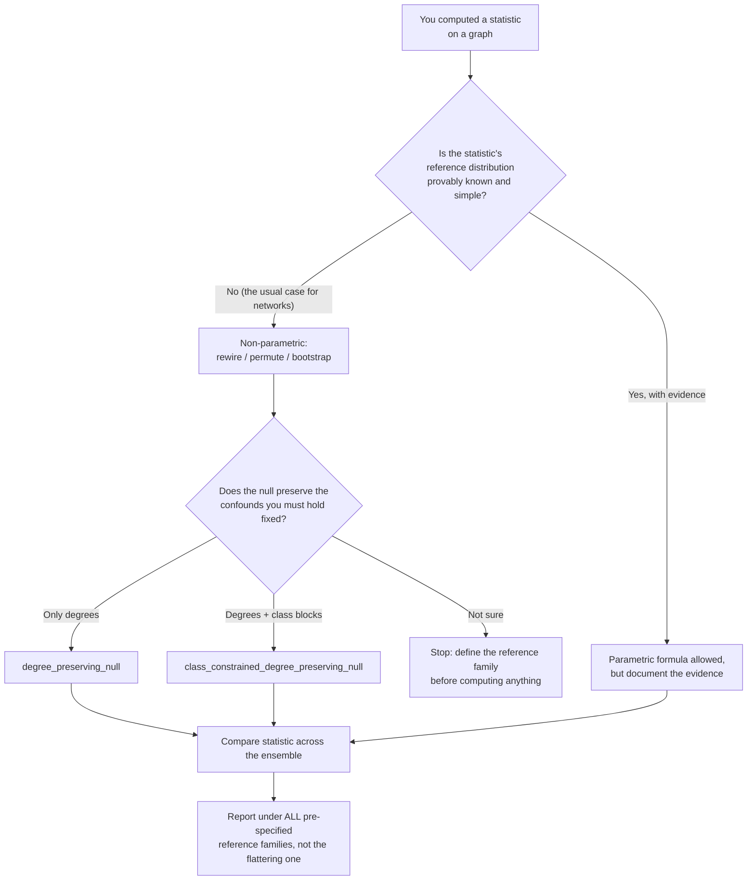

# Methods: How This Repository Works and How to Extend It Safely

Audience: **new contributors**, including those new to data science. This document explains what the code does today, why it is designed the way it is, which decisions are still open, and the statistical and engineering hygiene rules that every contribution must follow. Read it alongside [Methods Scope](METHODS_SCOPE.md), [Status and Plan](STATUS_AND_PLAN.md), and [Release Boundary](RELEASE_BOUNDARY.md).

## Done

Everything in this section is implemented, tested, and can be verified by running `python -m pytest -q`.

**Graph representation (`src/primary_graph.py`).** Frozen dataclasses define `Node` (integer index, string label), `Edge` (source, target, weight, optional kind), and `CollapsedEdge` (source, target, summed weight, raw row count). `select_nodes` filters nodes to a caller-supplied label set (default `{"group_a", "group_b", "group_c"}` — a convenience for synthetic examples only, not a biological claim) and returns them sorted; it raises `ValueError` if nothing matches. `collapse_edges` keeps only edges whose endpoints both survive selection, drops self-loops, sums weights per ordered pair, and raises `ValueError` if no eligible edge remains.

**Degree-preserving null model (`src/null_models.py`).** `graph_from_collapsed_edges` builds an unweighted `networkx.DiGraph` and rejects empty or self-loop-bearing input. `degree_signature` maps every node to its `(in_degree, out_degree)` pair. `degree_preserving_null` rewires via `networkx.algorithms.swap.directed_edge_swap` with `nswap = edges × swap_multiplier` (default 10) and `max_tries = nswap × 50`, then **validates its own invariants**: identical degree signature, no self-loops, else `ValueError`. Default seed is 0.

**Class-block-constrained null model (`src/class_constrained_null_models.py`).** `class_block_signature` counts edges per `(source_class, target_class)` block. `class_constrained_degree_preserving_null` partitions edges by block, performs targeted swaps only within blocks of size ≥ 2 (using a local `random.Random(seed)`, not the global RNG), rejects swaps that would create self-loops or duplicate edges, and raises if it cannot complete the requested successful swaps within `requested × 100` attempts. It then verifies degrees, block counts, and self-loop-freeness before returning.

**Motif counting (`src/motif_counts.py`).** A small `DirectedGraph` Protocol (just `predecessors` and `has_edge`) decouples counting from NetworkX. Implemented counters: `count_convergent_targets` (targets with at least `minimum_sources` distinct eligible predecessors; rejects `minimum_sources < 1`), `count_reciprocal_cross_group_pairs`, and `count_feed_forward_triangles` (ordered triples with first→middle, middle→final, and first→final edges). `src/m3_feed_forward_triangle.py` is a compatibility wrapper whose historical name (KC/MBIN/MBON) reflects the original mushroom-body question; it loads no data and makes no empirical claim.

**Completed diagnostics (recorded qualitatively).** Two predefined structural diagnostics were completed on a fixed labelled directed representation: the convergence diagnostic was **non-discriminative** under both predefined reference families, and the reciprocal-pair diagnostic **changed direction** between families. No numerical outcomes are stored in this tree, by design (see Release Boundary).

**Release-boundary scanner (`tools/check_public_release_boundary.py`).** Scans `git ls-files` paths and tracked text for prohibited path categories, binary/output suffixes, external URLs, personal-email patterns, and result-field markers. Run it before every review request.

## Intended

These directions are defined but not done; open issues track the contributor-sized pieces.

- **Empirical feed-forward-triangle comparison.** The triangle counter is implemented and synthetic-tested only; it has never been run on an approved empirical graph (issues #6, #9). Any such run requires prior maintainer approval of question, graph boundary, representation rules, diagnostic definition, and comparison procedure, evaluated against **both** reference families (issue #18 covers the scientific-owner gate).
- **Extended synthetic edge-case tests.** Issues #11–#15 specify small data-free tests: `collapse_edges` with no eligible non-self edge, rejection of a negative convergence threshold, degree-null rejection of a nonpositive multiplier, class-constrained-null rejection of a missing class assignment, and feed-forward counting with an empty group.
- **Documentation tightening.** Issues #9, #10, #16, #17 ask for clearer language on the unrun triangle status, reference-family interpretation limits, and integration of completed rewiring/motif safeguards into methods language.

## Design decisions and why

**Data-free by construction.** Every public function takes in-memory arguments; nothing reads files or writes outputs. *Why:* a reviewer can verify the entire computational surface, and the release boundary stays trivially auditable. *Consequence:* all inputs are the caller's responsibility, including documenting where they came from outside this tree.

**Protocol-based motif counting.** `motif_counts.py` depends on a two-method Protocol instead of `nx.DiGraph`. *Why:* motif logic can be tested against hand-rolled fake graphs and stays independent of any graph library's API changes.

**Fail loudly on invalid input.** Empty selections, nonpositive multipliers, missing class assignments, and self-loops all raise `ValueError` rather than silently coercing. *Why:* in a null-model pipeline, a silent no-op is worse than a crash — it produces a plausible-looking but wrong comparison.

**Post-hoc invariant verification in rewiring.** After rewiring, the code re-checks degrees, block counts, and self-loop-freeness instead of assuming the algorithm worked. *Why:* swap-based samplers can fail quietly when a graph is nearly rigid; the verification turns that silent failure into an explicit error.

**Local RNG for the class-constrained null.** It uses `random.Random(seed)` rather than the global random module. *Why:* callers' other random draws can never perturb the rewiring stream, so results reproduce exactly.

**Weights collapse, topology rewires.** `collapse_edges` preserves summed weights, but the null models operate on unweighted topology. *Why (and undecided):* degree-preserving swaps for *weighted* graphs are a harder sampling problem with weaker guarantees. **Options:** (a) keep binary topology for nulls — current choice, simplest and safest; (b) add a weighted null family later. **Selection rule:** stay binary unless a maintainer-approved question explicitly requires weights and a documented unbiased weighted-swap method is chosen first.

**Undecided: motif-counting approach for larger graphs.** **Options:** (a) the current direct enumeration via the Protocol — transparent, exact, fine for the synthetic and moderate sizes in scope; (b) subgraph-isomorphism library counters — faster on large graphs but add dependencies and obscure exactly what is counted. **Selection rule:** prefer direct enumeration until profiling on a maintainer-approved workload shows it is the bottleneck; transparency beats speed in this repository.

**Undecided: additional graph statistics.** Degree distributions, clustering, and path statistics are common next asks. **Selection rule:** add a statistic only if it has a synthetic invariant test (e.g., known value on a hand-computable graph) and a documented interpretation limit; never add a statistic that requires empirical data to exercise.

## Parametric vs. non-parametric: the decision guide

A **parametric** test assumes your statistic follows a specific mathematical distribution (often the bell-shaped normal distribution) and uses formulas to judge surprise. A **non-parametric** test — permutation, bootstrap, null-ensemble comparison — builds the reference distribution by shuffling or resampling the structure you actually have.

Concrete rules for this repository:

1. **Network statistics almost never follow a normal distribution.** Motif counts are bounded below by zero, discrete, and strongly skewed. Treat normality assumptions as guilty until proven innocent.
2. **Default to permutation/bootstrap/null-ensemble logic.** All comparison machinery here is rewiring-based (a null-ensemble approach) for exactly this reason.
3. **A parametric shortcut is acceptable only after** you demonstrate the statistic's null distribution is approximately normal across many rewired samples — and you must state that check, not imply it.
4. **Never report a p-value from an assumed distribution** when a shuffled reference ensemble is available and affordable.



## Hygiene rules

**Seeds.** Every randomized function takes an explicit seed (defaults: 0). When you add a randomized routine, thread the seed through, use a local RNG, and write a test asserting that two calls with the same seed produce identical output. Deterministic seeds here are *software defaults*, not a scientific protocol; any empirical protocol must document its own seed and sample-count choices separately.

**Graph randomization correctness.** Three traps, all guarded in code and tests: (1) swaps that create self-loops — rejected; (2) swaps that create duplicate edges, which would silently shrink a simple graph — rejected in the class-constrained null; (3) swaps that break the degree or block invariants — verified after rewiring, raising `ValueError` on failure. Additionally, naive accept-all swapping is known to sample directed graphs non-uniformly (Roberts and Coolen 2012, doi:10.1103/PhysRevE.85.046103), so treat any new rewiring scheme as needing documented justification, not just passing tests.

**Multiple comparisons.** Every motif you test is a lottery ticket; test twenty patterns and a random network will "win" one of them by chance. Rules: (a) pre-specify which diagnostics you will run before looking at any empirical output; (b) report all of them together — supportive, non-supportive, and unrun; (c) when a formal correction is needed, prefer a simple, explainable one (such as Bonferroni: multiply each p-value by the number of tests) over a clever one you cannot explain to a reviewer.

**Test discipline.** Tests use small, synthetic, in-memory fixtures only; they must never read or write repository data, result, figure, download, or archive paths (the scanner enforces this). Each new public function needs: a happy-path test on a hand-computable example, at least one rejection test for invalid input, and — for randomization — an invariant test (degrees, blocks, no self-loops) plus a same-seed reproducibility test. Before requesting review, run the full validation suite:

```bash
python -m pytest -q
python tools/check_public_release_boundary.py
python -m compileall -q src tests tools
```

**Interpretation discipline.** Software behavior is not a biological claim. Tests verify that code does what its docstring says; they say nothing about fly brains. Structural findings stay separate from functional, learning-related, mechanistic, or causal language — the repository's standing conclusion (inconclusive for enrichment; reference-family-sensitive reciprocal pairs) is the model for how to write about results.

## Where to start

Issues #11–#15 are deliberately small, data-free, and labeled `good first issue`. Pick one, follow the hygiene rules above, and run the three validation commands before opening your change.
