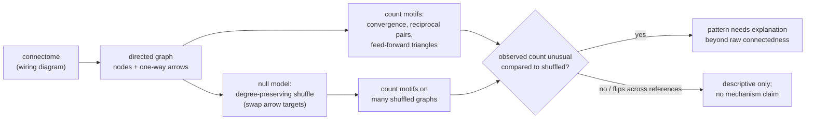

# Concept Figure: Wiring Diagram, Motifs, and the Null-Model Shuffle

This file is the tracked, text-only stand-in for the repository's concept
figure. The public release boundary does not permit image files or figure
directories in the tracked tree (see `tools/check_public_release_boundary.py`
and [RELEASE_BOUNDARY.md](RELEASE_BOUNDARY.md)), so the figure is expressed
here as a Mermaid diagram that any Markdown viewer with Mermaid support
renders automatically.

**Caption:** The repository's whole pipeline in one picture. A connectome
(wiring diagram) becomes a directed graph; small arrow patterns (motifs) are
counted on it; and a degree-preserving shuffle generates randomized reference
graphs that keep every node's number of incoming and outgoing arrows fixed.
A motif count only means something when compared against that reference
family — and different reference families can legitimately give different
answers.

Reading the diagram:

1. **Wiring diagram to graph.** Each neuron becomes a node; each one-way
   connection becomes a directed arrow.
2. **Motif counting.** Small patterns are tallied by explicit enumeration —
   the worked example in
   [EXTENDED_INTRODUCTION.md](EXTENDED_INTRODUCTION.md) (Part 5) counts them
   by hand on a four-node graph.
3. **The shuffle.** Two arrows A→B and C→D are rewired to A→D and C→B, over
   and over; every node keeps exactly its in- and out-degree.
4. **The comparison.** The real count is judged against the shuffled counts.
   The project's own result: one diagnostic was non-discriminative under
   both reference families, and another changed direction when the reference
   family changed — so the choice of shuffle is part of the science.
